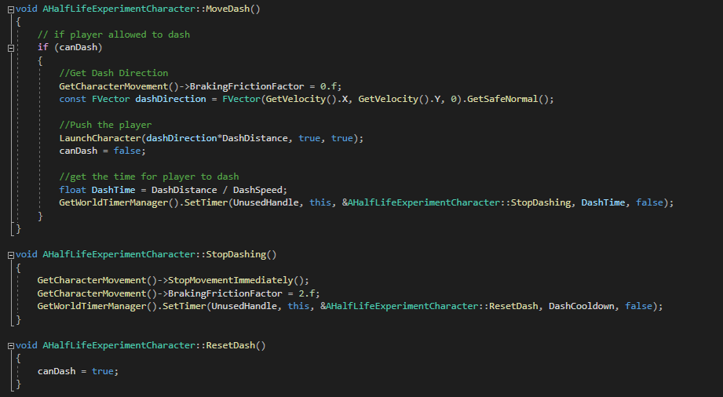
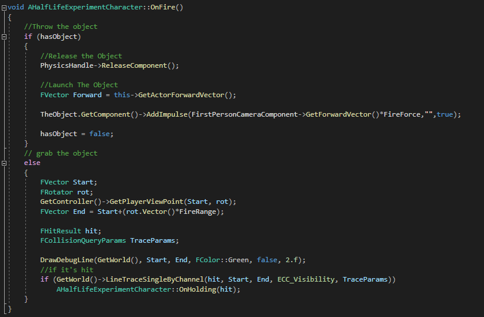
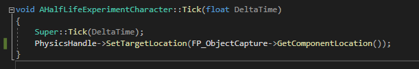
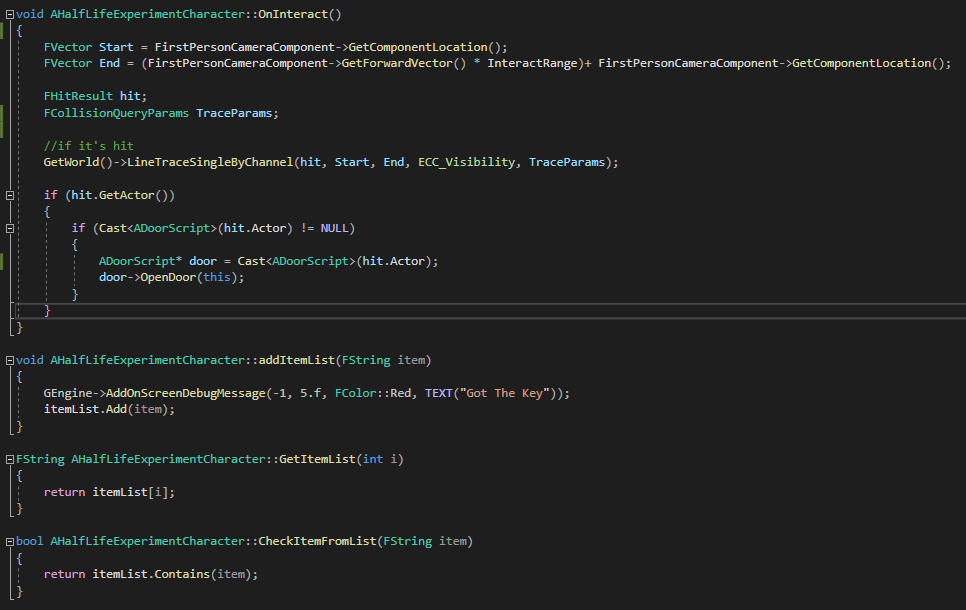
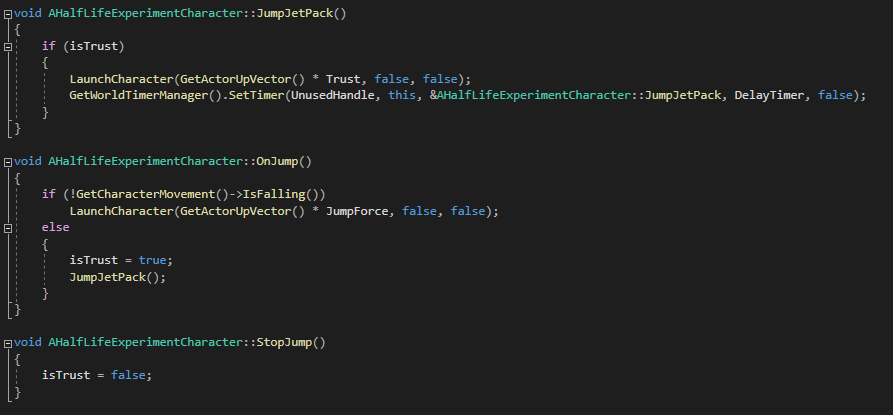
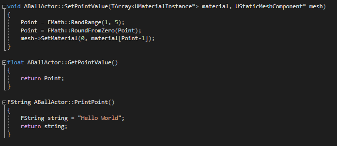
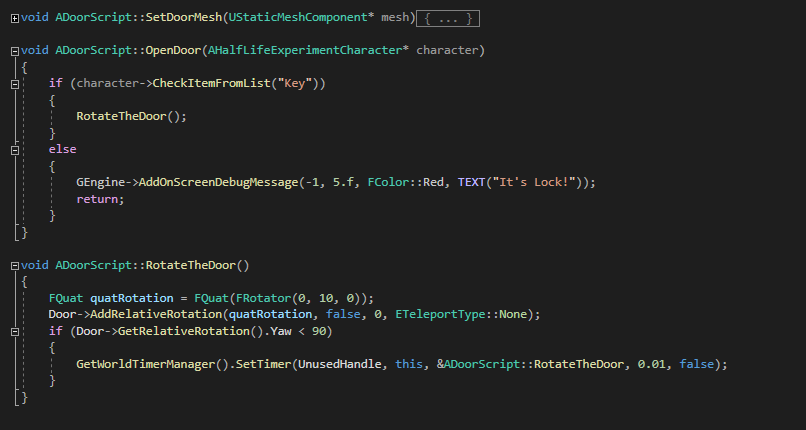

# HalfLifeExperiment
 
## Description
It's a first person Game that the player need grab the ball using a gravity gun and throw at the goal (Square) to get as many Point before times run out. The game using standard input system. This project build using c++ and small action were use with blueprint. 

## Input
- WASD -> Direction move
- Left Click -> Grab / Throw Object
- SpaceBar -> Jump / Use jet pack
- Shift -> Dash
- E -> Interact
- Mouse X and Y -> Camera Control

## Detail

### HalfLifeExperimentCharacter Class
- Dash System : It takes me a day to complete it. I taking advantage on implementing dash system from learning how c++ work and how c++ implement rather than blue print.

- Gravity Gun : The Gravity Gun is the challange part for me, the reason is that I have a hard time understand how the c++ implement it based on the blueprint. There isn't much of a reference in c++ that can help me point out my mistake. It takes me 1 whole day to figure out my mistake and complete it.
    - Fire
     

    - Grab
    
     
 
- Interact : interaction, ball and key system was complete more or less 1 and a half day include with creating the level for the gameplay. The implementation are combining with c++ and blueprint to help me understand how the c++ and blueprint can communicate.

- Jetpack System : Jetpack takes half a day for to implement it. Based on the past 2 /3 days implementing using c++, this task didn't give much of a challange.

### BallActor Class

### DoorScript Class

## Conclusion 
It takes longer than I expect on developing it but in the end, the result satified it. It's a challange for me as I try to figure out how to implement certain method or behavior in c++ based on how I implement it inside blueprint. There certain part that can be improve as Interact rather than use to open door it also can be use as take a object interact with anykind of object or display indicator to interact. I also plan to implement playfab to create leaderboard based on the result of total score and it display top 5 player in the game.