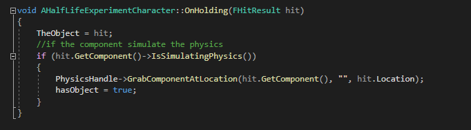

# HalfLifeExperiment
 
## Description
It's a first person Game that the player need grab the ball using a gravity gun and throw at the goal (Square) to get as many Point before times run out. The game using standard input system.

## Input
- WASD -> Direction move
- Left Click -> Grab / Throw Object
- SpaceBar -> Jump / Use jet pack
- Shift -> Dash
- E -> Interact
- Mouse X and Y -> Camera Control

## Detail

### HalfLifeExperimentCharacter Class
- Dash System  

- Gravity Gun  
    - Fire
     

    - Grab
    
     
 

- Interact  

- Jetpack System  

### BallActor Class

### DoorScript Class
